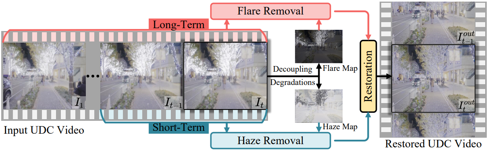
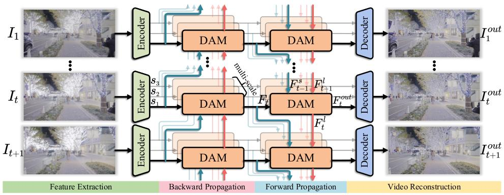
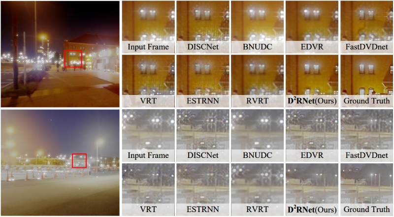
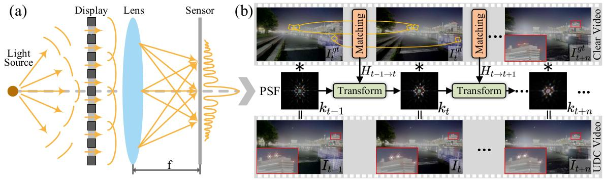
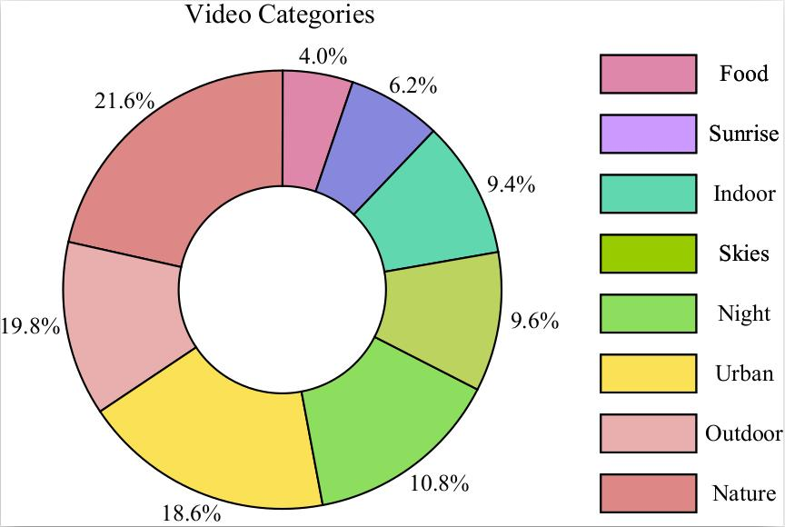

# [AAAI 2024] DDRNet
This is the official PyTorch implementation of the paper [Decoupling Degradations with Recurrent Network for Video Restoration in Under-Display Camera](https://).

## Contents
- [Introduction](#introduction)
  - [Contribution](#contribution)
  - [Overview](#overview)
  - [Visual](#Visual)
- [Dataset](#dataset)
- [Test](#test)
- [Train](#train)
- [Results](#results)
- [Citation](#citation)
- [Contact](#contact)
- [Acknowledgement](#acknowledgement)

## Introduction


### Contribution
* We propose a novel network with long- and short-term video representation learning by decoupling video degradations for the UDC video restoration task (D$^2$RNet), which is the first work to address UDC video degradation. The core decoupling attention module (DAM) enables a tailored solution to the degradation caused by different incident light intensities in the video. 
* We propose a large-scale UDC video restoration dataset (VidUDC33K), which includes numerous challenging scenarios. To the best of our knowledge, this is the first dataset for UDC video restoration.
* Extensive quantitative and qualitative evaluations demonstrate the superiority of D$^2$RNet. In the proposed VidUDC33K dataset, D$^2$RNet gains 1.02db PSNR improvements more than other restoration methods.
    
### Overview


### Visual


## Dataset
1. Download the original HDR video and real video from [google drive](http://) under `./dataset`.
2. Unzip the original HDR video and real video.
```
cd ./dataset
unzip Video.zip
unzip Real_Video.zip
```
3. Generate the sequences for training and testing based on `synthvideo_meta.txt` and `ZTE_new_psf_5.npy`, run
```
python generate_synthvideo.py
```
The principle of obtaining synthetic dataset is as follows:

4. Generate the sequences for real scenario validation based on `realvideo_meta.txt`, run
```
python generate_realdata.py
```
5. Make VidUDC33K structure be:
```
        ├────dataset
                ├────VidUDC33K
                        ├────Input
                                ├────000
                                        ├────000.npy
                                        ├────...
                                        ├────049.npy
                                ├────001
                                ├────...
                                ├────676
                        ├────GT
                                ├────000
                                        ├────000.npy
                                        ├────...
                                        ├────049.npy
                                ├────001
                                ├────...
                                ├────676
                ├────VidUDC33K_real
                        ├────Input
                                ├────000
                                        ├────000.npy
                                        ├────...
                                        ├────049.npy
                                ├────001
                                ├────...
                                ├────009
                        ├────GT
                                ├────000
                                        ├────000.npy
                                        ├────...
                                        ├────049.npy
                                ├────001
                                ├────...
                                ├────009
                ├────synthvideo_meta.txt
                ├────realvideo_meta.txt
                ├────ZTE_new_psf_5.npy
```
The distribution of the dataset is as follows:


## Test
1. Clone this github repo
```
git clone https://github.com/ChengxuLiu/DDRNet.git
cd DDRNet
```
2. Prepare testing dataset and modify "folder_lq" and "folder_lq" in `./test.py`
3. Run test
```
python test.py --save_result
```
4. The result are saved in `./results`

## Train
1. Clone this github repo
```
git clone https://github.com/ChengxuLiu/DDRNet.git
cd DDRNet
```
2. Prepare training dataset and modify "dataroot_gt" and "dataroot_lq" in `./options/DDRNet/train_DDRNet.json`
3. Run training
```
python train.py --opt ./options/DDRNet/train_DDRNet.json
```
4. The models are saved in `./experiments`


## Results
The output results on VidUDC33K testing set can be downloaded from [google drive](https://).

## Citation
If you find the code and pre-trained models useful for your research, please consider citing our paper. :blush:
```
@article{liu2023ttvfi,
  title={Ttvfi: Learning trajectory-aware transformer for video frame interpolation},
  author={Liu, Chengxu and Yang, Huan and Fu, Jianlong and Qian, Xueming},
  journal={IEEE Transactions on Image Processing},
  year={2023},
  publisher={IEEE}
}
``` 

## Contact
If you meet any problems, please describe them in issues or contact:
* Chengxu Liu: <liuchx97@gmail.com>

## Acknowledgement
The code of DDRNet is built upon [RVRT](https://github.com/JingyunLiang/RVRT) and [MMagic](https://github.com/open-mmlab/mmagic), and we express our gratitude to these awesome projects.


